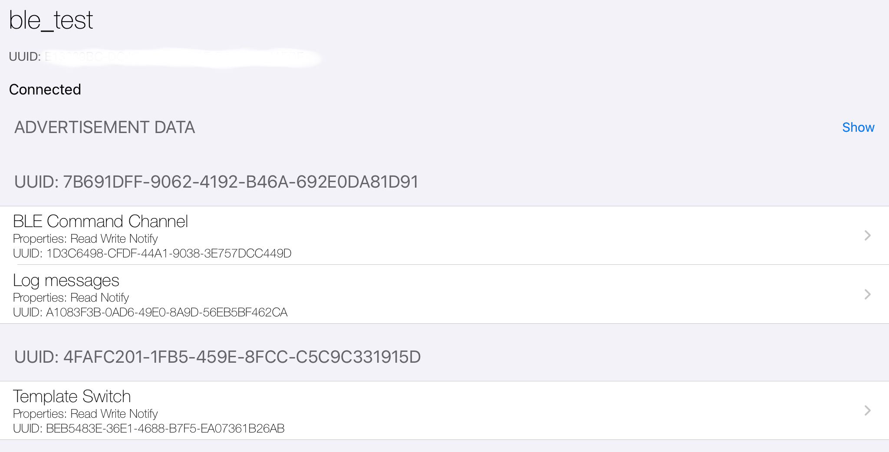
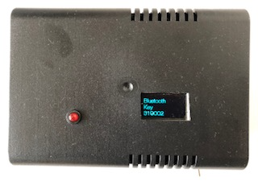

This component provides a Bluetooth Low Energy (BLE) controller for [ESPHome](https://esphome.io). It allows to monitor sensor data and control switches and other components via BLE connections (for example from a smart phone):



⚠️ **Note**: This controller only works with ESP32 micro-controllers, not with ESP8266 chips because they do not offer built-in BLE support.

## Installation
Copy the `esp32_ble_controller` directory into your ESPHome `custom_components` directory. (If you do not have such a directory yet, then create it in your ESPHome configuration directory, i.e. the directory storing your yaml files.)

## Configuration

### Getting started

The following configuration shows how to make a (template) switch accessible via BLE:
```yaml
switch:
  - platform: template
    name: "Template Switch"
    optimistic: true
    id: template_switch

esp32_ble_controller:
  services:
  - service: "4fafc201-1fb5-459e-8fcc-c5c9c331915d"
    characteristics:
      - characteristic: "beb5483e-36e1-4688-b7f5-ea07361b26ab"
        exposes: template_switch
```

You define your sensors, switches and other compoments as usual (like the [template switch](https://esphome.io/components/switch/template.html) in the example). 
Make sure to assign an id to each component you want to expose via bluetooth. 
Then you add `esp32_ble_controller` to include the controller itself. 
In order to make a component available you need to define a corresponding BLE characteristic that is contained in a BLE service. If you are not familiar with BLE you do need to worry much. For each characteristic and each service you simply need a different UUID, which you could generate [here](https://www.uuidgenerator.net). A service is basically used for grouping characteristics, so it can contain multiple characteristics. Each characteristic exposes a component, which is configured via the `exposes` property specifying the id of the respective component.

If you flash this example configuration and connect to your ESP32 device from your phone, you can see device information similar to the data displayed in the image above. Note how the service UUID and characteristic UUID provided in the characteristic configuration of the template switch now show up. Besides the switch that was configured explicitly there is also a so-called maintenance service which is provided by the controller automatically. It allows you to set BLE mode and access some logging related characteristics, which will be explained below.

### Configuration options

```yaml
esp32_ble_controller:
  services:
  - service: <service 1 UUID>
    characteristics:
      - characteristic: <characteristic 1.1 UUID>
        exposes: <id of component>
      - characteristic: <characteristic 1.2 UUID>
        exposes: <id of component>
  - service: <service 2 UUID>
    characteristics:
      - characteristic: <characteristic 2.1 UUID>
        exposes: <id of component>

  # allows to enable or disable security, default is 'show_pass_key'
  # Options:
  # - none: 
  #     disables security
  # - show_pass_key: 
  #     upon first pairing the other device (your phone) sends a 6-digit pass key to the ESP and the ESP is supposed to display so that it can be entered on the other device
  security_mode: show_pass_key

  # automation that is invoked when the pass key should be displayed, the pass key is available in the automation as "pass_key" variable of type std::string
  # the example below just logs the pass keys
  on_show_pass_key:
  - logger.log:
      format: "The pass key is %s"
      args: 'pass_key.c_str()'
  # automation that is invoked when the authentication is complete (either with success or failure)
  on_authentication_complete:
  - logger.log: "auth complete"
```

## Features

### BLE security

By default security is switched on, which means that the ESP32 has to paired (bonded) when it is used for the first time with a new device. (This feature can be switched off via configuration.) Protection against man-in-the-middle attacks is enabled. The device to be paired sends a pass key (a 6 digit PIN) to the ESP32, which is logged (on info level.) There is also an automation that allows showing the pass key on a display (until the paring is complete).

### Maintenance service

The maintenance BLE service is provided implicitly when you include `esp32_ble_controller` in your yaml configuration. It provides three characteristics:

* BLE Mode (read-write):  
This mode controls the balance between BLE and WiFi. Note that both BLE and WiFi share the same physical 2,4 GHz antenna on the ESP32. So too much traffic on both of them can cause it to crash and reboot. Here the modes come in handy. Switching the mode triggers a safe reboot of the ESP32.
  * 0 = BLE only: This is supposed to switch WiFi off completely and allow only BLE traffic.  
  ⚠️ **Note**: This not working yet!
  * 1 = mixed mode: This allows both BLE and WiFi traffic, but it may crash if there is too much traffic. (Short-lived WiFi connections for sending MQTT messages work fine, but for connecting to the web server `WiFi only` mode is recommended.)
  * 2 = WiFi only: This disables all non-maintenance BLE characteristics in order to reduce BLE traffic to the minimum. It also sets the log level to `configuration`. You can use this mode for [OTA updates](https://esphome.io/components/ota.html).
* Log level (read-write):  
Sets the log level for logging over BLE. Currently the levels have to be specified as integer number between 0 (= no logging) and 7 (= very verbose).  
  ⚠️ **Note**: You cannot get finer logging than the overall log level specified for the [logger component](https://esphome.io/components/logger.html).
* Log messages (read-only):  
Provides the latest log message that matches the configured log level.

### Supported components

* [Binary sensor](https://esphome.io/components/binary_sensor/index.html) (read-only)
* [Sensor](https://esphome.io/components/sensor/index.html) (read-only)
* [Text sensor](https://esphome.io/components/text_sensor/index.html) (read-only)
* [Switch](https://esphome.io/components/switch/index.html) (read-write)

# Examples

Configuration to show the pass key during authentication on a display like in this picture:


```yaml
display:
  - platform: ...
    ...
    pages:
      - id: page_standard
        lambda: |-
          // print standard stuff
      - id: page_ble_pass_key
        lambda: |-
          it.print(0, 0, id(my_font), TextAlign::TOP_LEFT, "Bluetooth");
          it.print(0, 20, id(my_font), TextAlign::TOP_LEFT, "Key");
          it.print(0, 40, id(my_font), TextAlign::TOP_LEFT, id(ble_pass_key).c_str());

globals:
  - id: ble_pass_key
    type: std::string

esp32_ble_controller:
  services:
  - service: "4fafc201-1fb5-459e-8fcc-c5c9c331915d"
    characteristics:
      - characteristic: "beb5483e-36e1-4688-b7f5-ea07361b26ab"
        exposes: template_switch
  security_mode: show_pass_key
  on_show_pass_key:
    then:
      - lambda: |-
          id(ble_pass_key) = pass_key;
      - display.page.show: page_ble_pass_key
      - component.update: my_display
  on_authentication_complete:
    then:
      - lambda: |-
          id(ble_pass_key) = "";
      - display.page.show: page_standard
      - component.update: my_display
```
